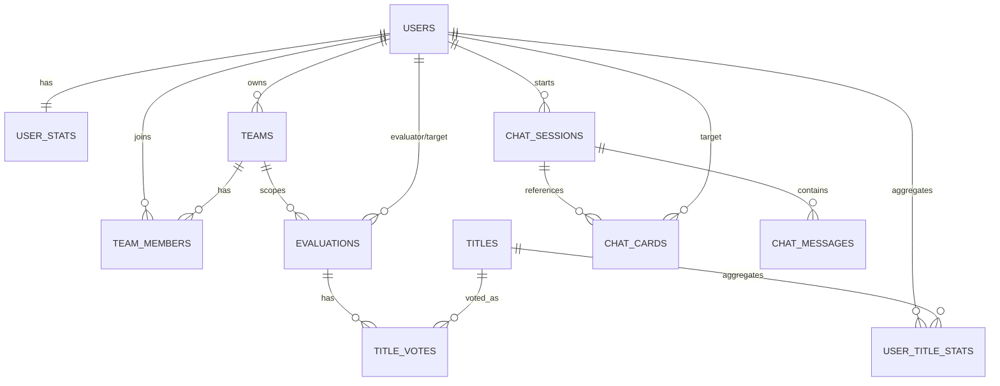

# 매드몬 도감 백엔드 개발 계획 (BACKEND_DEVELOPMENT_PLAN)

> 본 문서는 구현 이전 단계의 설계 문서입니다. 코드, Entity, Controller, Repository는 아직 작성하지 않았으며, 이 계획이 승인된 이후에 Phase 순서대로 구현을 시작합니다.

| 항목 | 내용 |
|---|---|
| 문서 작성일 | 2026-07-03 |
| 대상 프로젝트 | 매드몬 도감 (몰입캠프 참가자 상호 평가 및 팀 빌딩 플랫폼) |
| 백엔드 스택 | Java 21, Spring Boot 4.1.0, Gradle(Groovy), Spring Data JPA(Hibernate), PostgreSQL(Supabase), Spring Security + JWT, Supabase Storage, OpenAI API |
| 참고 문서 | `README.md`, `매드몬 도감_기능명세서.md`, `DB_Schema.png`, `main/build.gradle` |

---

## 1. 프로젝트 분석

### 1.1 프로젝트 목적

KAIST 몰입캠프 참가자들이 프로젝트를 함께 진행한 팀원을 대상으로 상호 평가를 진행하고, 그 결과를 게임 카드(매드몬 카드) 형태로 시각화하여 서로의 강점과 특징을 재미있게 공유하는 서비스입니다. 단순한 평가 도구가 아니라 **게임화(gamification)** 와 **AI 기반 분석**을 결합해 참가자 간 네트워킹과 팀 빌딩 경험을 향상시키는 것이 목적입니다.

### 1.2 핵심 기능 요약

기능명세서와 README 기획안을 종합하면 백엔드가 지원해야 할 핵심 기능은 다음과 같습니다.

1. **인증/초기 설정** — 최초 로그인 시 비밀번호 변경 강제, 프로필 사진·초기 능력치·자기소개(50자 이내) 설정
2. **팀 관리** — 팀 생성 시 고유 초대 코드 발급, 초대 코드로 팀 참여, 한 사용자가 여러 팀에 동시 소속 가능(N:M), 팀 탈퇴
3. **상호 평가** — 프로젝트 종료 후 같은 팀원끼리만 6개 항목(공격력/방어력/Speed/협업/창의성/문제해결력, 각 1~10점) 평가, 평가는 제출 후 수정 불가
4. **칭호 투표** — 평가와 함께 사전 정의된 칭호 목록 중에서 투표, 투표 수 집계, 최다 득표 칭호를 대표 칭호로 표시(동점 시 공동 표시)
5. **능력치 산정(난독화)** — 단순 평균이 아닌 과거 점수와 신규 평가를 반영하는 누적 알고리즘(EMA 계열)으로 능력치를 갱신하여 최신 평가 점수를 역산할 수 없도록 함
6. **카드 도감** — 전체 참가자 카드 목록/상세 조회(앞면: 프로필·이름·대표 칭호·육각형 그래프, 뒷면: 상세 수치·칭호별 득표수·자기소개), 평가 미완료 시 상세/AI 기능 잠금
7. **AI 카드 분석** — 개별 카드 질문, 2인 이상 비교 분석, 여러 명을 묶은 팀 조합/시너지 분석, 대화형 세션으로 이전 맥락을 이어가는 채팅
8. **이미지 저장** — 프로필 사진을 Supabase Storage에 업로드하고 URL을 사용자 정보에 저장

### 1.3 주요 도메인

ERD(`DB_Schema.png`)와 기능명세서를 대조한 결과, 아래 8개의 응집도 높은 도메인으로 구분됩니다.

| 도메인 | 책임 | 관련 테이블 |
|---|---|---|
| `auth` | 로그인, JWT 발급/검증, 비밀번호 변경 | (Entity 없음, `user` 도메인 재사용) |
| `user` | 사용자 프로필, 초기 능력치, 누적 능력치(user_stats) | `users`, `user_stats` |
| `team` | 팀 생성/참여, 팀원 관리, 초대 코드 | `teams`, `team_members` |
| `evaluation` | 팀원 상호 평가 제출, 능력치 갱신 트리거 | `evaluations` |
| `title` | 칭호 마스터 데이터, 투표, 집계 캐시, 대표 칭호 산정 | `titles`, `title_votes`, `user_title_stats` |
| `card` | 카드 도감 조회(읽기 전용 조합 API), 잠금(gating) 로직 | 자체 Entity 없음 — `user`/`title`/`evaluation` 조합 |
| `chat` | AI 질문 세션, 카드/팀 지정, 메시지 이력 | `chat_sessions`, `chat_cards`, `chat_messages` |
| `storage` | Supabase Storage 업로드/URL 발급 | Entity 없음 — `user.profile_image`에 URL 저장 |

`common`, `config`는 도메인이 아니라 횡단 관심사(BaseEntity, 예외 처리, 공통 응답, 보안/외부 API 설정)를 담당합니다.

### 1.4 전체 시스템 흐름

```
[신규 사용자 계정 생성(운영진이 사전 발급)]
        │
        ▼
1) 로그인(auth) → 최초 로그인 시 비밀번호 변경 강제
        │
        ▼
2) 프로필 초기 설정(user) → 프로필 사진 업로드(storage) + 초기 능력치 + 자기소개
        │
        ▼
3) 팀 생성/참여(team) → 초대 코드 발급 또는 코드 입력으로 team_members 등록
        │
        ▼
4) [프로젝트 진행 기간 — 서비스 외부 활동]
        │
        ▼
5) 프로젝트 종료 후 평가(evaluation) → 같은 팀 소속 팀원에게 6항목 평가 + 칭호 투표(title)
        │
        ▼
6) 평가 제출 시 user_stats 갱신(EMA 누적 알고리즘) + user_title_stats 집계 갱신
        │
        ▼
7) 카드 도감 조회(card) → 평가 완료 여부에 따라 상세 정보 잠금/해제, 대표 칭호 계산
        │
        ▼
8) AI 카드 분석(chat) → 카드/팀 데이터 기반 프롬프트 생성 → OpenAI API 호출 → 세션에 대화 저장
```

이 흐름에서 `user`는 모든 도메인의 기반이 되고, `evaluation`은 `team`(같은 팀 여부 검증)과 `user`(대상자 존재 검증)에 의존하며, `card`와 `chat`은 다른 모든 도메인의 데이터를 읽기 전용으로 조합하는 최상위 소비자입니다. 이 의존 방향이 이후 Phase 순서와 API 구현 순서의 근거가 됩니다.

---

## 2. 백엔드 아키텍처

### 2.1 계층 구조

Layered Architecture를 도메인별로 적용합니다.

```
Controller  →  요청/응답 매핑, @Valid 검증, DTO 변환만 담당 (비즈니스 로직 없음)
    │
Service     →  트랜잭션 경계(@Transactional), 비즈니스 로직, 도메인 간 조합
    │
Repository  →  Spring Data JPA 인터페이스, 영속성 접근만 담당
    │
Entity      →  DB 테이블 매핑, 도메인 불변조건(invariant) 캡슐화
```

- **DTO 경계**: Entity는 어떤 계층에서도 Controller 밖으로 직접 반환하지 않습니다. Request DTO → Service에서 Entity 변환, Entity → Response DTO 변환 후 반환.
- **의존 방향**: Controller → Service → Repository 단방향. Service는 다른 도메인의 Service를 호출해 조합하며(예: `card` 도메인 서비스가 `user`/`title` 서비스를 호출), Repository를 직접 넘나들지 않습니다.
- **생성자 주입만 사용**하며 Lombok `@RequiredArgsConstructor` + `final` 필드로 통일합니다.
- **예외 흐름**: 각 도메인의 커스텀 예외(`XxxNotFoundException` 등)는 `common.exception`의 `GlobalExceptionHandler`가 일괄 처리하여 표준 에러 응답으로 변환합니다.

### 2.2 패키지 구조

`com.madmon.main`(기존 `MainApplication` 패키지)을 루트로, 도메인 중심 패키지를 구성합니다.

```
com.madmon.main
├── MainApplication.java
│
├── auth                      # 로그인/JWT — Entity 없음(user 재사용)
│   ├── controller
│   ├── service
│   ├── dto
│   ├── jwt                   # JwtTokenProvider, JwtAuthenticationFilter
│   └── exception
│
├── user                      # 사용자 프로필 + 누적 능력치
│   ├── controller
│   ├── service
│   ├── repository
│   ├── entity                # User, UserStats
│   ├── dto
│   └── exception
│
├── team                      # 팀 생성/참여/관리
│   ├── controller
│   ├── service
│   ├── repository
│   ├── entity                # Team, TeamMember
│   ├── dto
│   └── exception
│
├── evaluation                # 팀원 상호 평가
│   ├── controller
│   ├── service
│   ├── repository
│   ├── entity                # Evaluation
│   ├── dto
│   └── exception
│
├── title                     # 칭호 마스터/투표/집계
│   ├── controller
│   ├── service
│   ├── repository
│   ├── entity                # Title, TitleVote, UserTitleStats
│   ├── dto
│   └── exception
│
├── card                      # 카드 도감 조회 전용(읽기 조합 계층)
│   ├── controller
│   ├── service                # user/title/evaluation 서비스를 조합
│   ├── dto
│   └── exception
│
├── chat                       # AI 질문/분석
│   ├── controller
│   ├── service
│   ├── repository
│   ├── entity                # ChatSession, ChatCard, ChatMessage
│   ├── dto
│   ├── client                 # OpenAiClient (외부 API 연동)
│   └── exception
│
├── storage                    # Supabase Storage 연동
│   ├── service
│   ├── dto
│   ├── client                 # SupabaseStorageClient
│   └── exception
│
├── common                     # 횡단 관심사
│   ├── entity                 # BaseEntity(생성/수정일시 Auditing)
│   ├── exception               # GlobalExceptionHandler, ErrorCode, BusinessException
│   ├── response                 # ApiResponse<T>, ErrorResponse
│   └── util
│
└── config
    ├── SecurityConfig
    ├── JpaAuditingConfig
    ├── WebConfig                # CORS 등
    ├── OpenAiConfig              # RestClient/WebClient Bean, API Key
    └── SupabaseStorageConfig     # Storage 접속 정보 Bean
```

`card`가 자체 Entity/Repository 없이 서비스 조합 계층만 갖는 것은 의도된 설계입니다. 카드 도감은 `user`, `user_stats`, `title`, `user_title_stats`를 읽기 전용으로 결합한 뷰이므로, 별도 테이블을 두지 않고 기존 도메인의 조회 기능을 재사용해 DRY 원칙을 지킵니다.

### 2.3 데이터 흐름 (요청 → 응답 예시)

평가 제출 API를 예로 계층 간 데이터 흐름을 설명합니다.

```
POST /api/teams/{teamId}/evaluations
  → EvaluationController: @Valid EvaluationRequest 검증(JWT에서 evaluatorId 추출)
  → EvaluationService.submit()
      1. TeamRepository/TeamMemberRepository로 evaluator·target이 같은 팀인지 검증
      2. 이미 제출한 평가인지 검증(재작성 금지)
      3. Evaluation Entity 저장
      4. UserStatsService.updateScores() 호출 → EMA 알고리즘으로 user_stats 갱신
      5. TitleVoteService.registerVotes() 호출 → title_votes 저장, user_title_stats 갱신
  → EvaluationResponse DTO로 변환 후 ApiResponse<EvaluationResponse>로 반환
```

이처럼 하나의 API 호출이 여러 도메인 서비스를 조합하지만, 각 도메인은 자신의 Repository만 사용하고 다른 도메인의 Repository에 직접 접근하지 않습니다(도메인 간 결합은 Service 인터페이스 수준에서만 발생).

---

## 3. 도메인 설계

ERD(`DB_Schema.png`) 기준으로 11개 테이블을 정리합니다. (아직 Entity를 생성하지 않으며, 이는 설계 설명입니다.)

### 3.1 User 도메인

**User** (`users`)
- 사용자 기본 정보: `password_hash`, `name`, `profile_image`(Supabase Storage URL), `biography`(50자 제한)
- 초기 능력치 6종: `initial_attack`, `initial_defense`, `initial_speed`, `initial_teamwork`, `initial_creativity`, `initial_problem_solving`
- `password_changed`: 최초 로그인 여부 판정 플래그(비밀번호 변경 강제 로직에 사용)
- `created_at`, `updated_at`

**UserStats** (`user_stats`, User와 1:1, `user_id`가 PK 겸 FK)
- 6개 항목의 **누적 반영(EMA) 점수**: `attack_score` 등 float, 단순 평균이 아닌 난독화 알고리즘 결과
- `evaluation_count`: 지금까지 반영된 평가 수(EMA 가중치 계산에 사용)
- User 생성 시 초기값(`initial_*`)으로 시드되고, 매 평가마다 갱신됨

관계: `User 1 --- 1 UserStats` (User 생성 시 UserStats도 함께 생성)

### 3.2 Team 도메인

**Team** (`teams`)
- `name`, `invite_code`(고유, 6자리 영숫자 등), `owner_id`(User FK, 팀장)
- 관계: `User 1 --- N Team`(owner로서)

**TeamMember** (`team_members`)
- `team_id`, `user_id` 복합 참조, `joined_at`, `left_at`(탈퇴 시각, 탈퇴해도 레코드 유지 → 평가 기록 보존 요구사항 충족), `project_finished`(해당 팀의 프로젝트 종료 여부 — 평가 활성화 여부 판단 기준)
- 관계: `Team 1 --- N TeamMember N --- 1 User` → **Team과 User는 N:M**, 한 사용자가 여러 팀에 속할 수 있다는 요구사항을 만족

### 3.3 Evaluation 도메인

**Evaluation** (`evaluations`)
- `team_id`(어느 팀 컨텍스트의 평가인지), `evaluator_id`, `target_id`(모두 User FK)
- 6개 항목 원점수: `attack`, `defense`, `speed`, `teamwork`, `creativity`, `problem_solving` (각 1~10)
- `total_score`(항목 합계, 서버에서 계산 후 저장), `created_at`
- 불변조건: 동일 `(team_id, evaluator_id, target_id)` 조합은 1회만 존재(재작성 금지) → Repository/Service 레벨에서 유니크 제약 + 애플리케이션 검증 이중화 권장

관계: `Team 1 --- N Evaluation`, `User 1 --- N Evaluation`(evaluator로서), `User 1 --- N Evaluation`(target으로서)

### 3.4 Title 도메인

**Title** (`titles`) — 사전 정의된 칭호 마스터 데이터(`name`, `description`, `icon`). 관리자/초기 데이터로 시딩.

**TitleVote** (`title_votes`) — 평가 1건에 종속된 칭호 투표. `evaluation_id`(FK), `title_id`(FK). 하나의 Evaluation에 여러 TitleVote가 달릴 수 있음(한 평가자가 한 팀원에게 여러 칭호 투표 가능).

**UserTitleStats** (`user_title_stats`) — 집계 캐시 테이블. `user_id`, `title_id`, `vote_count`. TitleVote가 생성될 때마다 해당 `(user_id, title_id)` 조합의 `vote_count`를 증가시켜, 대표 칭호 조회 시 매번 `title_votes`를 집계하지 않고 빠르게 조회하도록 함(기능명세서 4.5.3 "대표 칭호 캐싱"과 일치).

관계: `Evaluation 1 --- N TitleVote N --- 1 Title`, `User 1 --- N UserTitleStats N --- 1 Title`

**대표 칭호 계산 로직**: 특정 User의 `UserTitleStats`를 `vote_count` 내림차순 정렬 → 최댓값과 동일한 `vote_count`를 가진 모든 Title을 대표 칭호로 반환(동점 시 공동 표시).

### 3.5 Chat 도메인

**ChatSession** (`chat_sessions`) — `user_id`(질문한 사용자), `title`(세션 제목, 예: "이디자와의 시너지 분석"), `created_at`. 하나의 세션 안에서 대화가 이어짐(요구사항 "이전 대화를 이어가는 채팅").

**ChatCard** (`chat_cards`) — `session_id`, `target_user_id`. 세션 하나에 여러 ChatCard가 연결될 수 있어 **개별 카드 질문(1개), 비교 분석(2개 이상), 팀 조합 분석(여러 명)** 을 모두 동일한 구조로 표현 가능.

**ChatMessage** (`chat_sessions` 1:N) — `session_id`, `role`(user/assistant), `content`, `created_at`. OpenAI Chat Completion의 대화 이력을 그대로 저장하여 컨텍스트를 이어감.

관계: `User 1 --- N ChatSession 1 --- N ChatCard(N --- 1 User)`, `ChatSession 1 --- N ChatMessage`

### 3.6 ERD 요약



---

## 4. 개발 Phase

의존 관계(§1.4, §3)에 따라 총 11개 Phase로 나눕니다. 각 Phase는 이전 Phase가 완료되어야 시작할 수 있습니다.

### Phase 1 — 프로젝트 초기 설정
- **목표**: 실행 가능한 최소 골격 구축, Supabase PostgreSQL 연결 확립
- **구현 내용**:
  - `application.yml` 공통 DataSource에 Supabase Shared Pooler의 **Session mode** 연결을 설정하고, `local`/`prod` 프로필에서 함께 사용
  - Session Pooler의 host, port(`5432`), username(`postgres.<project-ref>`), DB password는 환경변수로 주입하고 JDBC SSL을 기본 적용
  - `spring.jpa.hibernate.ddl-auto=update`(개발 단계) 설정
  - 필요 의존성 추가 검토: JWT 라이브러리(예: `io.jsonwebtoken:jjwt`), `spring-boot-starter-webflux` 또는 `RestClient` 기반 외부 API 호출용 설정(OpenAI, Supabase Storage REST 호출용)
  - `.env`/환경변수 관리 방식 정의(민감정보 Git 미포함 확인)
- **완료 조건**: `./gradlew bootRun`으로 앱이 기동되고 Supabase Session Pooler를 통해 DB 커넥션이 성공적으로 맺어짐(로그로 확인)
- **선행 작업**: 없음
- **산출물**: `application.yml`, DB 연결 확인 로그, 갱신된 `build.gradle`

### Phase 2 — 공통 기반(Common/Config) 구축
- **목표**: 모든 도메인이 공유할 표준을 먼저 세워 이후 Phase의 반복 작업을 줄임
- **구현 내용**:
  - `common.entity.BaseEntity`(생성/수정 일시 Auditing, `@CreatedDate`/`@LastModifiedDate`)
  - `common.response.ApiResponse<T>`, `ErrorResponse` 표준 포맷 정의
  - `common.exception.GlobalExceptionHandler`, `ErrorCode`(enum), `BusinessException` 골격
  - `config.SecurityConfig` 뼈대(아직 인가 규칙은 최소화, Phase 4에서 확장)
  - `config.WebConfig`(CORS 정책 — 프론트엔드 도메인 허용)
- **완료 조건**: 임의의 테스트 컨트롤러에서 예외 발생 시 표준 에러 응답 포맷으로 반환됨을 확인
- **선행 작업**: Phase 1
- **산출물**: `common`, `config` 패키지 기반 클래스 일체

### Phase 3 — Entity 및 Repository 작성 (전 도메인)
- **목표**: ERD의 11개 테이블을 JPA Entity로 매핑하고 Supabase에 실제 테이블 생성(ddl-auto)
- **구현 내용**: §3에서 설계한 순서(§6 DB 구현 순서 참고)대로 `User`, `UserStats`, `Team`, `TeamMember`, `Title`, `Evaluation`, `TitleVote`, `UserTitleStats`, `ChatSession`, `ChatCard`, `ChatMessage` Entity + 각 도메인 Repository 작성
  - 연관관계는 지연 로딩(`FetchType.LAZY`) 기본, N+1 방지를 위해 필요한 조회는 이후 Phase에서 Fetch Join/DTO Projection으로 최적화
  - 칭호 마스터 데이터(`titles`) 초기 시딩 전략 결정(예: `data.sql` 또는 애플리케이션 시작 시 `CommandLineRunner`)
- **완료 조건**: 앱 기동 시 Supabase에 11개 테이블이 정상 생성되고, Repository 단위 테스트로 기본 CRUD 동작 확인
- **선행 작업**: Phase 2
- **산출물**: 전 도메인 `entity`/`repository` 패키지, 초기 칭호 시드 데이터

### Phase 4 — 인증(JWT 로그인/비밀번호 변경)
- **목표**: `auth` 도메인 완성, 이후 모든 API의 인가 기반 마련
- **구현 내용**:
  - `JwtTokenProvider`(Access/Refresh 토큰 발급·검증). 두 토큰은 `tokenType`(`ACCESS`/`REFRESH`) 클레임으로 구분되며, `JwtAuthenticationFilter`는 `tokenType=ACCESS`인 토큰만 인증 주체로 인정한다(REFRESH 토큰을 그대로 Bearer로 사용해 access token 대신 쓰는 것을 차단)
  - 로그인 API(`POST /api/auth/login`), 리프레시 API(`POST /api/auth/refresh` — refresh token 검증 후 새 access/refresh 토큰 쌍 재발급, `permitAll`), 비밀번호 변경 API(`PATCH /api/auth/password`, 최초 로그인 시 `password_changed=false`이면 다른 API 접근 제한)
    - 비밀번호 변경 성공 시에도 새 access/refresh 토큰 쌍을 즉시 응답에 포함한다. 기존에 발급된 토큰은 `passwordChanged=false` 클레임을 그대로 들고 있어, 새 토큰을 내려주지 않으면 클라이언트가 재로그인하기 전까지 계속 `PASSWORD_CHANGE_REQUIRED`(403)를 받기 때문이다.
  - `SecurityConfig` 완성: `/api/auth/login`, `/api/auth/refresh`만 공개 경로, 나머지는 인증 필요. `SecurityContext`에서 `userId` 추출 유틸
- **완료 조건**: 로그인 성공 시 JWT 발급, 보호된 API에 토큰 없이 접근 시 401, 최초 로그인 사용자는 비밀번호 변경 전까지 다른 API 접근 차단, refresh token으로 access token 재발급 가능, refresh token 자체로는 보호된 API에 접근 불가, 비밀번호 변경 직후 새 토큰으로 즉시 잠금 해제
- **선행 작업**: Phase 3(User Entity/Repository)
- **산출물**: `auth` 패키지 전체, 완성된 `SecurityConfig`

### Phase 5 — User API (프로필/초기 능력치)
- **목표**: 프로필 초기 설정 및 조회 기능 완성
- **구현 내용**: 프로필 조회(`GET /api/users/me`), 프로필 수정(`PATCH /api/users/me` — 자기소개/프로필사진 URL 갱신), 초기 능력치 입력 API(`PATCH /api/users/me/initial-stats`), Validation(`biography` 50자, 능력치 1~10 정수)
  - 초기 능력치 입력은 **1회성(one-shot)** 으로 구현했다. 이미 `UserStats`가 생성된 사용자가 다시 요청하면 `409 INITIAL_STATS_ALREADY_SET`을 반환한다. Phase 8에서 평가 기반 EMA 누적이 시작되면 `user_stats`가 더 이상 "초기값"이 아니게 되므로, 재제출로 누적된 점수가 초기값으로 덮어써지는 사고를 막기 위함이다.
  - `GET /api/users/me` 응답에는 `onboarded`(= UserStats 존재 여부) 플래그와, 존재할 때만 `stats`(6개 능력치 + `evaluationCount`)를 포함한다.
- **완료 조건**: 로그인한 사용자가 자신의 프로필/초기 능력치를 저장·조회 가능, UserStats가 초기값으로 시딩됨(`UserControllerTest` 7개 케이스로 검증: 조회, 미인증 401, 프로필 수정, 자기소개 길이 초과 400, 초기 능력치 설정, 범위 초과 400, 중복 설정 409)
- **선행 작업**: Phase 4
- **산출물**: `user` 패키지의 controller/service/dto

### Phase 6 — Storage 연동 (프로필 이미지)
- **목표**: 프로필 사진 업로드를 Supabase Storage와 연동
- **구현 내용**: `storage.client.SupabaseStorageClient`(Storage REST API 호출), 업로드 API(`POST /api/users/me/profile-image`), 업로드 성공 시 반환된 public URL을 `User.profile_image`에 저장, 이미지 형식/크기 제한 검증
- **완료 조건**: 이미지 업로드 시 Supabase Storage 버킷에 파일이 저장되고 User 프로필에 URL이 반영됨
- **선행 작업**: Phase 5
- **산출물**: `storage` 패키지, User 프로필과의 연동 지점

### Phase 7 — Team API
- **목표**: 팀 생성/참여/조회/탈퇴 기능 완성
- **구현 내용**: 팀 생성(고유 초대 코드 생성 로직 포함), 초대 코드로 참여, 내 팀 목록/상세 조회, 팀 탈퇴(`left_at` 기록, 레코드는 보존), 중복 참여 방지 검증
- **완료 조건**: 여러 팀에 동시 소속 가능, 초대 코드 유효성 검증 및 중복 방지 동작 확인
- **선행 작업**: Phase 5
- **산출물**: `team` 패키지 전체

### Phase 8 — Evaluation & Title API
- **목표**: 상호 평가 제출과 칭호 투표, 능력치 누적 갱신 알고리즘 완성 — 이 프로젝트의 핵심 도메인 로직
- **구현 내용**:
  - 평가 대상자 목록 조회(같은 팀 & `project_finished=true` & 아직 평가하지 않은 팀원)
  - 평가 제출 API: 6항목 점수 + 칭호 투표를 하나의 트랜잭션으로 처리, 총점 범위 검증(§13 열린 질문 참고), 재작성 금지 검증
  - `UserStatsService`: EMA 기반 누적 반영 알고리즘 구현 및 단위 테스트(동일 입력에 대해 재현 가능하되 외부에서 단일 평가 원점수를 역산할 수 없음을 검증)
  - `TitleVoteService`: `title_votes` 저장 + `user_title_stats` 원자적 증가(동시성 고려, `SELECT ... FOR UPDATE` 또는 `@Version` 낙관적 락 검토)
- **완료 조건**: 평가 제출 시 Evaluation, TitleVote, UserStats, UserTitleStats가 모두 일관되게 갱신됨을 통합 테스트로 검증
- **선행 작업**: Phase 7
- **산출물**: `evaluation`, `title` 패키지 전체

### Phase 9 — Card API (도감 조회 + 잠금)
- **목표**: 여러 도메인을 조합한 읽기 전용 카드 도감 API 완성
- **구현 내용**:
  - 카드 목록 조회(앞면 정보만 축약 — 잠금 여부와 무관하게 항상 노출)
  - 카드 상세 조회(뒷면 포함) — 평가 완료 여부 판정 로직(`isUnlocked`) 적용: 사용자가 속한 `project_finished=true` 팀들의 팀원 전원에 대한 평가를 모두 제출했는지 검사
  - 대표 칭호 계산(§3.4 로직 재사용)
  - (선택) 이름/능력치/칭호 검색·정렬 필터
- **완료 조건**: 평가 미완료 사용자는 카드 상세에서 잠금 응답(`isUnlocked=false` + `remainingCount`)을 받고, 완료 시 즉시 해제됨
- **선행 작업**: Phase 8
- **산출물**: `card` 패키지 전체

### Phase 10 — AI Chat API
- **목표**: OpenAI API 연동을 통한 카드 질문/비교/팀 분석 기능 완성
- **구현 내용**:
  - `chat.client.OpenAiClient`(Chat Completions 호출, API Key는 환경변수)
  - 세션 생성/조회 API, 메시지 전송 API(개별 카드 질문/비교/팀 분석 — `ChatCard` 개수로 유형 구분)
  - 프롬프트 빌더: Card 도메인 데이터(능력치, 칭호, 자기소개)를 컨텍스트로 구성
  - 대화 이력 저장 및 이어가기, 잠금 상태 연동(카드가 잠긴 사용자는 AI 질문 API 자체를 403 처리)
  - (선택) Rate Limiting 적용(예: 분당 요청 수 제한)
- **완료 조건**: 카드 1개/2개 이상/팀 단위 질문이 각각 정상 동작하고, 동일 세션 내 후속 질문이 이전 맥락을 반영함을 확인
- **선행 작업**: Phase 9
- **산출물**: `chat` 패키지 전체

### Phase 11 — 통합 테스트 정리 및 배포 준비
- **목표**: 전체 API 회귀 테스트, 배포 환경 구성
- **구현 내용**: E2E 시나리오 테스트(§11), `Dockerfile` 작성, 환경변수/시크릿 분리, 배포 문서화(§12)
- **완료 조건**: Docker 이미지로 로컬 실행 시 전체 플로우(로그인→팀→평가→도감→AI) 정상 동작
- **선행 작업**: Phase 4~10
- **산출물**: `Dockerfile`, 배포 스크립트/문서, 최종 API 문서

---

## 5. API 구현 순서 및 이유

Phase 순서가 곧 API 구현 순서입니다. 근거는 다음과 같습니다.

1. **인증이 먼저다**: 이후 모든 API가 `SecurityContext`의 `userId`에 의존하므로, JWT 인증 없이는 어떤 도메인 API도 의미 있게 테스트할 수 없습니다.
2. **User → Team → Evaluation 순서는 FK 의존 순서와 동일**: Evaluation은 반드시 "같은 팀 소속"을 검증해야 하므로 Team API가 먼저 완성되어야 하고, Team 역시 User가 존재해야 owner를 지정할 수 있습니다.
3. **Evaluation·Title이 Card보다 먼저인 이유**: Card 도메인은 자체 데이터를 생성하지 않고 User/Evaluation/Title의 결과를 읽기만 하는 소비자이므로, 소스 데이터를 만드는 API가 먼저 존재해야 통합 테스트가 가능합니다.
4. **Chat이 마지막인 이유**: AI 프롬프트는 Card 도메인이 제공하는 요약 데이터(능력치, 대표 칭호, 자기소개)를 그대로 활용하므로 Card API 완성 후에 진행해야 재작업이 없습니다. 또한 외부 유료 API(OpenAI) 연동은 나머지 로직이 안정된 뒤 마지막에 붙이는 것이 비용/디버깅 측면에서 안전합니다.
5. **Storage는 User 프로필 흐름 중간에 배치**: 프로필 사진은 User 도메인의 하위 기능이지만 외부 연동이라는 독립적 성격이 있어 별도 Phase로 분리하되, User API 직후 배치해 흐름이 끊기지 않게 했습니다.

---

## 6. DB 구현 순서

`ddl-auto=update`를 사용하더라도 Hibernate가 FK 제약을 올바르게 생성하려면 Entity 작성 순서(및 연관관계 매핑 방향)를 FK 의존성 순서와 맞추는 것이 안전합니다. Supabase PostgreSQL에는 다음 순서로 테이블이 생성되도록 Entity를 작성합니다.

| 순서 | 테이블 | 의존 대상 |
|---|---|---|
| 1 | `titles` | 없음(독립) |
| 2 | `users` | 없음(독립) |
| 3 | `user_stats` | `users` |
| 4 | `teams` | `users`(owner_id) |
| 5 | `team_members` | `teams`, `users` |
| 6 | `evaluations` | `teams`, `users`(evaluator/target) |
| 7 | `title_votes` | `evaluations`, `titles` |
| 8 | `user_title_stats` | `users`, `titles` |
| 9 | `chat_sessions` | `users` |
| 10 | `chat_cards` | `chat_sessions`, `users` |
| 11 | `chat_messages` | `chat_sessions` |

`titles`는 독립 테이블이지만 칭호 투표(Phase 8)에서만 실제로 쓰이므로, 테이블 자체는 Phase 3에서 미리 생성하고 초기 데이터 시딩만 Phase 3~4 사이에 진행합니다.

---

## 7. 인증 및 인가

### 7.1 JWT 구조

- **Access Token**: 짧은 만료(기본 1시간), Claim에 `userId`, `passwordChanged`, `tokenType=ACCESS` 포함 → 필터에서 비밀번호 미변경 사용자를 조기에 차단 가능
- **Refresh Token**: 긴 만료(기본 2주), Claim은 Access Token과 동일하되 `tokenType=REFRESH`로 구분. `POST /api/auth/refresh`에서만 사용하며, 이 엔드포인트는 `tokenType=REFRESH`인 토큰만 허용한다
  - `JwtAuthenticationFilter`는 `tokenType=ACCESS`인 토큰만 인증 주체로 받아들이므로, Refresh Token을 그대로 `Authorization: Bearer`로 보내 access token 대신 사용할 수 없다(구분 클레임이 없던 초기 구현에서는 이게 가능해 access token을 짧게 잡은 의도가 무력화되는 문제가 있었음 — Phase 4에서 수정)
  - 서버 측 revoke 목록(강제 로그아웃)은 아직 두지 않는다. 필요해지면 별도 Phase에서 결정
- 서명 알고리즘: HS256(대칭키, 환경변수로 시크릿 관리) — 단일 백엔드 서버 구조이므로 비대칭키(RS256)까지는 불필요

### 7.2 권한 관리 방식

이 서비스는 복잡한 Role 체계보다 **리소스 기반 인가**가 핵심입니다.

- 기본 인증: 로그인 사용자만 API 접근 가능(`ROLE_USER`)
- **팀 단위 인가**: 팀 상세/평가 관련 API는 `TeamMember`에 존재하는 사용자만 접근 가능하도록 Service 레벨에서 검증(Spring Security의 Role보다 도메인 로직으로 처리하는 것이 적합)
- **평가 잠금(gating) 인가**: 카드 상세/AI 질문 API는 "활성 평가를 모두 완료했는가"를 Service에서 판정 후 403 또는 잠금 상태를 담은 응답 반환
- **관리자 기능**(선택 기능 — 평가 수정 등)은 필요 시에만 `ROLE_ADMIN`을 별도로 추가하며, MVP 범위에서는 우선순위가 낮으므로 후순위 Phase로 미룹니다.

---

## 8. AI 기능 설계

### 8.1 OpenAI API 사용 방식

- Spring 6.1+/Boot 4의 `RestClient`(또는 `WebClient`)로 OpenAI Chat Completions 엔드포인트를 직접 호출합니다. 별도 SDK 의존성 없이 REST 호출로 충분하며, 필요 시 공식 Java SDK로 교체 가능하도록 `OpenAiClient` 인터페이스로 추상화합니다.
- API Key는 환경변수(`OPENAI_API_KEY`)로 주입하고 코드/설정 파일에 하드코딩하지 않습니다.

### 8.2 프롬프트 설계

세 가지 질문 유형(개별 카드 / 비교 / 팀 분석)에 따라 `ChatCard` 개수를 기준으로 프롬프트 컨텍스트를 분기합니다.

- **개별 카드 질문**: 대상자 1명의 능력치(난독화된 `user_stats`), 대표 칭호, 자기소개를 시스템 프롬프트에 포함하고 사용자 질문을 이어 붙임
- **비교 분석**: 대상자 2명 이상의 동일 정보를 나란히 제공, "강점/약점 비교" 형식을 유도하는 시스템 지시문 사용
- **팀 조합 분석**: 선택된 전원의 정보를 요약 리스트로 제공하고 "시너지/역할 분배" 관점의 응답을 유도

### 8.3 대화 이어가기 및 이력 저장

`ChatSession` 하나가 하나의 연속된 대화 맥락을 나타내며, 후속 질문 시 해당 세션의 `ChatMessage` 이력을 함께 OpenAI API에 전달해 컨텍스트를 유지합니다. 모든 요청/응답은 `ChatMessage`(role: user/assistant)로 저장되어 사용자가 이전 분석을 다시 확인할 수 있습니다.

### 8.4 안정성 고려사항

- 잠금 상태(§4.6 카드 상세 잠금)인 사용자는 채팅 API 자체에서 차단
- OpenAI API 오류(타임아웃, 요청 실패) 시 `common.exception` 표준 에러로 변환해 반환
- (선택 기능) 사용자별 분당 요청 수 제한으로 비용 통제

---

## 9. 이미지 저장 구조

- 프로필 사진은 Supabase Storage의 전용 버킷(예: `profile-images`)에 저장합니다.
- 백엔드는 Supabase Storage REST API를 `storage.client.SupabaseStorageClient`를 통해 호출하여 파일을 업로드하고, 업로드 성공 시 반환되는 **public URL**(또는 서명된 URL)을 `users.profile_image` 컬럼에 문자열로 저장합니다. 즉, DB는 파일 자체가 아니라 URL만 보관합니다.
- 업로드 흐름: 클라이언트가 `multipart/form-data`로 이미지를 백엔드에 전송 → 백엔드가 크기/확장자(PNG, JPG 등)를 검증 → Supabase Storage에 업로드 → URL을 User Entity에 반영 → 갱신된 프로필 응답 반환.
- Storage 접속 정보(Project URL, Service Role Key)는 `config.SupabaseStorageConfig`에서 환경변수로 주입합니다.
- (선택 기능) 프로필 사진이 없는 사용자를 위한 기본 아바타 URL은 상수 또는 설정값으로 관리합니다.

---

## 10. 예외 처리 전략

### 10.1 Global Exception Handler

`@RestControllerAdvice` 기반 `common.exception.GlobalExceptionHandler`가 모든 컨트롤러의 예외를 일괄 처리합니다.

| 예외 유형 | 처리 |
|---|---|
| 도메인 커스텀 예외(`BusinessException` 상속) | 예외에 담긴 `ErrorCode`로 상태코드/메시지 결정 |
| `MethodArgumentNotValidException`(Validation 실패) | 400, 필드별 오류 메시지 배열 포함 |
| `AuthenticationException`/JWT 검증 실패 | 401 |
| 인가 실패(팀 소속 아님 등) | 403 |
| 리소스 없음(`XxxNotFoundException`) | 404 |
| 그 외 미처리 예외 | 500, 상세 스택은 로그로만 남기고 응답에는 노출하지 않음 |

각 도메인은 자신만의 예외를 `도메인패키지.exception`에 정의하고 `ErrorCode` enum에 코드를 등록하는 방식으로 확장하여, GlobalExceptionHandler 자체는 도메인 지식 없이도 일관되게 동작하게 합니다.

### 10.2 Validation

- 요청 DTO에 Bean Validation(`@NotBlank`, `@Size(max=50)`, `@Min(1) @Max(10)` 등)을 적용하고 Controller에서 `@Valid`로 검증합니다.
- 단순 필드 검증을 넘어서는 규칙(같은 팀 여부, 평가 재작성 금지, 총점 범위 등)은 Service 레이어에서 도메인 예외로 처리합니다.

### 10.3 Error Response 형식

```json
{
  "success": false,
  "errorCode": "EVALUATION_ALREADY_SUBMITTED",
  "message": "이미 제출한 평가는 수정할 수 없습니다.",
  "timestamp": "2026-07-03T12:00:00"
}
```

성공 응답도 동일한 포맷(`ApiResponse<T>`)으로 통일합니다.

```json
{
  "success": true,
  "data": { "...": "..." },
  "timestamp": "2026-07-03T12:00:00"
}
```

---

## 11. 테스트 전략

| 계층 | 도구 | 대상 | 우선순위 근거 |
|---|---|---|---|
| Repository | `@DataJpaTest` | 연관관계 매핑, 커스텀 쿼리 | Entity 설계 오류를 가장 초기에 발견 |
| Service | 순수 단위 테스트(Mockito) | 평가 점수 누적(EMA) 알고리즘, 대표 칭호 결정(동점 처리), 잠금(gating) 판정 로직 | 이 프로젝트의 핵심 비즈니스 규칙이 몰려 있어 회귀 위험이 가장 큼 |
| API(통합) | `@SpringBootTest` + `MockMvc`(또는 `WebTestClient`) | 인증 흐름, 평가 제출 트랜잭션 전체, 카드 잠금/해제 시나리오 | 여러 도메인이 얽히는 지점의 실제 동작 검증 |
| 외부 연동 | Mock 서버(WireMock 등) 또는 인터페이스 Mock | OpenAI API, Supabase Storage 호출 | 실제 외부 API 비용/불안정성 없이 검증 |

특히 **능력치 산정 알고리즘**과 **대표 칭호 동점 처리**는 사용자가 육안으로 검증하기 어려운 로직이므로 Service 단위 테스트를 Phase 8에서 반드시 함께 작성합니다.

---

## 12. 배포 전략

- **Docker**: `main/Dockerfile`을 Multi-stage 빌드(Gradle 빌드 스테이지 → JRE 21 실행 스테이지)로 작성하여 이미지 크기를 최소화합니다. 환경변수(DB 접속정보, JWT 시크릿, OpenAI Key, Supabase Storage Key)는 이미지에 포함하지 않고 실행 시 주입합니다.
- **Supabase**: PostgreSQL 서버로만 사용하며, Supabase 자체 Auth/Realtime 기능은 사용하지 않습니다(요구사항에 명시된 대로 Spring Security + JWT로 자체 인증을 구현). Storage 기능만 별도로 사용합니다.
- **KCLOUD**: 빌드된 Docker 이미지를 KCLOUD 인스턴스에 배포합니다. 배포 파이프라인(수동 또는 GitHub Actions 기반 CI/CD)은 Phase 11에서 팀 논의 후 확정합니다.
- **환경 분리**: `application-local.yml` / `application-prod.yml`로 프로파일을 분리하고, 민감 정보는 `.env` 또는 배포 플랫폼의 Secret 관리 기능을 사용합니다.

---

## 13. 리스크 및 열린 질문 (Open Questions)

구현 시작 전에 팀 논의가 필요한 스펙상의 모호한 지점을 명시합니다.

1. **평가 총점 범위 불일치**: 기능명세서 3.3에는 "최대 40점, 최소 6점"이라는 문구와 "6개 항목 × 1~10점이므로 6~60점"이라는 문구가 함께 등장합니다. 6항목 × 1~10점의 산술적 범위는 6~60점이 맞으므로, **총점 검증은 6~60점 범위로 구현**하는 것을 기본안으로 제안합니다. 확정 필요.
2. **팀 미참여 사용자의 카드 잠금 정책**: 기능명세서 4.6에 "정책 선택 필요"로 명시되어 있습니다. 평가 대상 자체가 없는 사용자는 잠금 없이 열람 허용하는 것을 기본안으로 제안합니다.
3. **능력치 난독화 알고리즘의 구체적 파라미터**: EMA 방식을 채택할 경우 가중치(α) 값, 혹은 베이지안 업데이트 방식을 사용할지 여부를 Phase 8 착수 전 확정이 필요합니다.
4. **평가 수정 권한(운영진)**: 기능명세서에 "운영진만 관리자 화면에서 수정 가능"이 언급되나 관리자 기능은 선택 기능으로 분류되어 있어 MVP 범위 포함 여부 확인이 필요합니다.
5. **최초 계정 발급 방식**: 회원가입 플로우가 명세되어 있지 않고 "최초 로그인"만 언급됩니다. 운영진이 사전에 계정을 일괄 생성(시드)하는 방식으로 가정했습니다. 확인 필요.

---

## 14. 다음 단계

이 계획이 승인되면 **Phase 1(프로젝트 초기 설정)** 부터 순서대로 구현을 시작합니다. Phase 진행 중 §13의 열린 질문 중 해당 Phase에 영향을 주는 항목이 있다면 그 시점에 다시 확인 후 진행합니다.
