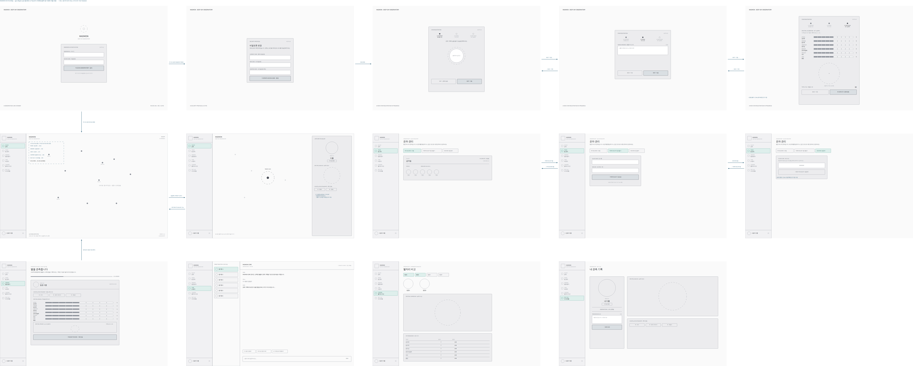

# 26s-w1-c1-03

## 공통과제 I : 웹 기반 프로젝트 (2인 1팀)

**목적:** 공통 과제를 함께 수행하며 웹 개발의 전체 흐름을 빠르게 익히고 협업에 적응하기

**결과물:** 기획부터 배포까지 완료된 웹 서비스와 관련 문서 일체

---

## 팀원

| 이름 | GitHub | 역할 |
|---|---|---|
| 권순호 | [rth934](https://github.com/rth934) | FrontEnd Dev |
| 이지민 | [ljm030206](https://github.com/ljm030206) | BackEnd Dev |
| 정서영 | [seooyy](https://github.com/seooyy) | BackEnd Dev |

---

## 기획안

> 프로젝트 주제, 목적, 핵심 기능, 예상 사용자, 팀원별 역할 등 정리

### **주제**

**MADNOVA**
몰입캠프 참가자들을 게임 캐릭터처럼 카드로 수집하고, 팀원 간의 평가를 기반으로 능력치와 칭호를 부여하는 AI 기반 참가자 도감 서비스.


### **목적**

기존의 단순한 팀원 평가를 재미있는 게임 요소와 결합하여 참가자들이 서로의 장점과 특징을 쉽게 이해하고 공유할 수 있는 플랫폼을 제공한다. 또한 AI를 활용해 참가자들의 능력과 팀 조합을 분석하고 추천함으로써 몰입캠프 참가자 간의 상호작용과 커뮤니티 경험을 향상시키는 것을 목표로 한다.


### **핵심 기능**

* **참가자 카드 시스템**

  * 모든 참가자의 카드 조회
  * 카드 앞면: 프로필 사진, 이름, 대표 칭호, 육각형 능력치 그래프
  * 카드 뒷면: 상세 능력치, 획득 칭호, 자기소개

* **팀 기반 평가 시스템**

  * 프로젝트 종료 후 같은 팀원끼리만 평가 가능
  * 공격력, 방어력, 속도, 협업, 창의성, 문제 해결 능력 등 6개 항목 평가
  * 칭호 투표 기능 제공

* **능력치 및 칭호 산정**

  * 단순 평균이 아닌 누적 반영 알고리즘을 이용하여 능력치 계산
  * 가장 많은 표를 받은 칭호를 대표 칭호로 표시
  * 동점일 경우 모든 대표 칭호 표시

* **AI 카드 분석**

  * 특정 참가자의 특징 분석
  * 두 참가자의 능력 비교
  * 여러 참가자를 선택하여 팀 조합 및 시너지 분석
  * 카드 정보를 기반으로 자연어 질의응답 제공

* **팀 관리**

  * 팀 생성
  * 초대 코드 기반 팀 참여
  * 프로젝트 종료 후 평가 권한 관리

* **사용자 관리**

  * 로그인 및 비밀번호 변경
  * 프로필 사진 및 자기소개 설정
  * 초기 능력치 입력

### **예상 사용자**

* KAIST 몰입캠프 참가자
* 프로젝트를 함께 진행하는 팀원
* 다른 참가자의 강점과 특징을 확인하고 싶은 캠프 참가자
* AI를 활용하여 참가자 비교나 팀 조합을 분석해보고 싶은 사용자

## 기능 명세서

> 구현할 기능을 사용자 관점에서 정리하고, 필수 기능과 선택 기능을 구분

### 필수 기능

* [x] 로그인 및 최초 로그인 시 비밀번호 변경
* [x] 프로필 사진, 초기 능력치, 한 줄 자기소개 설정
* [x] 팀 생성 및 초대 코드 기반 팀 참여
* [x] 팀원 목록 조회
* [ ] 프로젝트 종료 후 팀원 상호 평가
* [ ] 6개 능력치(공격력, 방어력, Speed, 협업, 창의성, 문제 해결 능력) 평가
* [ ] 팀원 칭호 투표
* [ ] 평가 점수 및 칭호 저장
* [ ] 평가 결과를 반영한 능력치 계산(평균이 아닌 누적 반영 알고리즘)
* [ ] 대표 칭호 계산 및 표시(동점 시 공동 표시)
* [x] 참가자 카드 도감 조회
* [x] 카드 앞면(프로필, 이름, 대표 칭호, 육각형 그래프) 표시
* [x] 카드 뒷면(상세 능력치, 칭호 목록, 자기소개) 표시
* [x] 개별 카드 AI 질문
* [x] 여러 참가자를 선택한 팀 조합 및 카드 비교 AI 분석
* [ ] AI 대화 내역 저장 및 이전 대화를 이어가는 채팅 기능


### 선택 기능

* [x] 카드 검색 및 이름/능력치/칭호별 필터링
* [x] 카드 정렬(이름순, 능력치순 등)
* [x] 카드 Flip 애니메이션 및 게임 스타일 UI
* [ ] 평가 진행률 표시
* [ ] 평가 완료 시에만 카드 상세 및 AI 기능 열람 가능(잠금 기능)
* [ ] AI 질문 및 답변 기록 조회
* [x] AI 응답 스트리밍 및 로딩 애니메이션
* [ ] AI 요청 횟수 제한(Rate Limiting)
* [x] 프로필 사진 기본 아바타 제공
* [ ] 팀 탈퇴 및 팀 관리 기능
* [ ] 대표 칭호 및 능력치 캐싱을 통한 조회 성능 향상
* [ ] 관리자 기능(평가 수정, 사용자 관리 등)
* [ ] 사용자 활동 통계 및 랭킹
* [ ] 모바일 반응형 UI 지원


---

## IA 및 화면 설계서

> 서비스의 전체 페이지 구조와 페이지 간 이동 흐름; 각 페이지의 주요 UI 구성, 입력 요소, 버튼, 사용자 행동 흐름 등을 간단한 와이어프레임 형태로 정리

<!-- Figma 링크 또는 이미지 첨부 -->


자세한 와이어프레임은 아래 Figma 링크에서 확인할 수 있습니다.

[Figma Wireframe 보기](https://www.figma.com/design/WMpfUenDYD9xxfdElZkIfv/%EB%A7%A4%EB%93%9C%EB%AA%AC-%EB%8F%84%EA%B0%90-%EC%99%80%EC%9D%B4%EC%96%B4%ED%94%84%EB%A0%88%EC%9E%84?node-id=0-1&t=XtlvI7OwAqt8XBG2-1)

---

## DB 스키마

> 필요한 테이블, 주요 필드, 데이터 타입, 테이블 간 관계를 정리

<!-- ERD 이미지 또는 테이블 정의 -->
[DB_Schema](./DB_Schema.png)

---

## API 문서

> API 주소, 요청 방식, 요청값, 응답값, 에러 상황을 정리

### 공통 사항

- **Base URL**: `/api`
- **인증**: `/api/auth/login`, `/api/auth/refresh`를 제외한 모든 엔드포인트는 `Authorization: Bearer <accessToken>` 헤더가 필요하다.
- **응답 포맷(성공)**: 모든 성공 응답은 아래 형태로 감싸져 내려온다. 아래 각 엔드포인트의 `Response`는 `data` 필드의 내용만 표기한다.
  ```json
  { "success": true, "data": { ... }, "timestamp": "2026-07-07T12:00:00" }
  ```
- **응답 포맷(실패)**: 4xx/5xx 응답은 아래 형태이며, `errorCode`로 분기 처리한다. `errors`는 요청 값 검증(`@Valid`) 실패 시에만 필드별 사유가 채워진다.
  ```json
  { "success": false, "errorCode": "INVALID_INPUT_VALUE", "message": "입력값이 올바르지 않습니다.", "errors": [], "timestamp": "..." }
  ```
- **능력치 6항목**: 모든 능력치는 `attack`(공격력) · `defense`(방어력) · `agility`(민첩성) · `teamwork`(협동력) · `mana`(마력) · `health`(체력) 6개 필드로 구성된다.
- **잠금 정책**: 자신이 속한 팀 중 마감이 지난 팀이 하나라도 있으면, 그 팀의 팀원 전원을 평가할 때까지 카드 상세/AI 분석 기능이 잠긴다(같은 사람과 여러 팀을 함께했어도 평가는 한 번만 하면 된다). 평가 대상 자체가 없으면 잠금 없이 열람 가능하다.

### 인증 (Auth)

| Method | Endpoint | 설명 | 인증 |
|---|---|---|---|
| POST | `/api/auth/login` | 로그인, 토큰 발급 | 불필요 |
| POST | `/api/auth/refresh` | 토큰 재발급 | 불필요 |
| PATCH | `/api/auth/password` | 비밀번호 변경 | 필요 |

```
POST /api/auth/login
  Request   { userId, password }
  Response  { accessToken, refreshToken, passwordChanged }
  Errors    INVALID_CREDENTIALS

POST /api/auth/refresh
  Request   { refreshToken }
  Response  { accessToken, refreshToken, passwordChanged }
  Errors    INVALID_REFRESH_TOKEN

PATCH /api/auth/password
  설명      비밀번호 변경 성공 시 갱신된 passwordChanged 상태를 담은 새 토큰 쌍을 즉시 반환한다.
  Request   { currentPassword, newPassword }
  Response  { accessToken, refreshToken, passwordChanged }
  Errors    INVALID_CREDENTIALS
```

### 사용자 (User)

| Method | Endpoint | 설명 | 인증 |
|---|---|---|---|
| GET | `/api/users/me` | 내 프로필 조회 | 필요 |
| PATCH | `/api/users/me` | 프로필 수정 (부분 수정) | 필요 |
| PATCH | `/api/users/me/initial-stats` | 초기 능력치 설정(최초 1회) | 필요 |
| POST | `/api/users/me/profile-image` | 프로필 사진 업로드 | 필요 |

```
GET /api/users/me
  Response  { id, userId, name, profileImageUrl, biography, passwordChanged, onboarded, stats }
            stats는 온보딩(초기 능력치 설정) 전에는 null.

PATCH /api/users/me
  설명      요청 JSON에 없는(null) 필드는 기존 값을 그대로 유지한다(부분 수정).
  Request   { profileImageUrl?, biography? }
  Response  위 GET과 동일한 UserProfileResponse
  Errors    INVALID_INPUT_VALUE

PATCH /api/users/me/initial-stats
  Request   { attack, defense, agility, teamwork, mana, health }  # 각 1~10
  Response  UserProfileResponse
  Errors    INITIAL_STATS_ALREADY_SET, INVALID_INPUT_VALUE

POST /api/users/me/profile-image
  설명      multipart/form-data, 필드명 file (PNG/JPEG/WEBP, 5MB 이하)
  Response  UserProfileResponse
  Errors    STORAGE_UPLOAD_FAILED
```

### 팀 (Team)

| Method | Endpoint | 설명 | 인증 |
|---|---|---|---|
| POST | `/api/teams` | 팀 생성 | 필요 |
| POST | `/api/teams/join` | 초대 코드로 팀 참여 | 필요 |
| GET | `/api/teams` | 내 팀 목록 조회 | 필요 |
| GET | `/api/teams/{teamId}` | 팀 상세(멤버 목록) 조회 | 필요 |
| DELETE | `/api/teams/{teamId}/members/me` | 팀 탈퇴 | 필요 |

```
POST /api/teams
  설명      생성자가 자동으로 팀장 겸 첫 멤버가 된다.
  Request   { name, projectDeadline }
  Response  { id, name, inviteCode, ownerId, ownerName, memberCount, projectDeadline }
  Errors    INVALID_INPUT_VALUE

POST /api/teams/join
  설명      탈퇴 후 재참여 포함. 마감 기한이 지난 팀은 신규/재참여 모두 불가.
  Request   { inviteCode }
  Response  위 POST /api/teams와 동일한 TeamResponse
  Errors    TEAM_NOT_FOUND, ALREADY_TEAM_MEMBER, TEAM_DEADLINE_PASSED

GET /api/teams
  Response  TeamResponse[]  (탈퇴하지 않은 팀만)

GET /api/teams/{teamId}
  Response  { team: TeamResponse, members: TeamMemberResponse[] }
            TeamMemberResponse: { userId, loginId, name, profileImageUrl, isOwner }
  Errors    TEAM_NOT_FOUND, NOT_TEAM_MEMBER

DELETE /api/teams/{teamId}/members/me
  Response  없음
  Errors    NOT_TEAM_MEMBER
```

### 팀원 평가 (Evaluation)

| Method | Endpoint | 설명 | 인증 |
|---|---|---|---|
| GET | `/api/evaluations/targets` | 평가해야 할 대상자 목록 조회 | 필요 |
| POST | `/api/evaluations` | 팀원 평가 제출 | 필요 |

```
GET /api/evaluations/targets
  설명      같은 사람과 여러 팀을 함께했어도 평가 대상은 한 번만 노출된다.
  Response  { teamId, teamName, userId, name, profileImageUrl, alreadyEvaluated }[]

POST /api/evaluations
  설명      능력치 6항목 + 칭호 투표(중복 선택 불가). 같은 대상은 팀이 달라도 한 번만 평가 가능.
            점수는 단순 평균이 아니라 EMA(지수 이동 평균, α=0.3)로 누적 반영된다.
  Request   { teamId, targetUserId, attack, defense, agility, teamwork, mana, health, titleIds[] }  # 점수 각 1~10
  Response  { id, teamId, targetUserId, totalScore }
  Errors    PROJECT_NOT_FINISHED, NOT_TEAM_MEMBER, EVALUATION_ALREADY_SUBMITTED,
            TITLE_NOT_FOUND, INVALID_INPUT_VALUE
```

### 카드 도감 (Card)

| Method | Endpoint | 설명 | 인증 |
|---|---|---|---|
| GET | `/api/cards` | 전체 참가자 카드 목록 조회 | 필요 |
| GET | `/api/cards/{userId}` | 카드 상세 조회 | 필요 |

```
GET /api/cards
  Response  CardSummaryResponse[]
            { userId, name, profileImageUrl, representativeTitles[], stats, isUnlocked, remainingCount }

GET /api/cards/{userId}
  Response  CardDetailResponse
            { userId, name, profileImageUrl, representativeTitles[], stats, isUnlocked,
              remainingCount, biography, titles }
            titles: { name, icon, voteCount }[]
  Errors    RESOURCE_NOT_FOUND

  잠긴 상태(isUnlocked=false)에서는 이름/프로필사진/대표 칭호만 내려오고 stats·biography·titles는
  null이다. remainingCount는 잠금 해제까지 남은 평가 인원 수.
```

### AI 분석 (Chat)

| Method | Endpoint | 설명 | 인증 |
|---|---|---|---|
| POST | `/api/chat/sessions` | 분석 세션 생성 | 필요 |
| GET | `/api/chat/sessions` | 내 세션 목록 조회 | 필요 |
| GET | `/api/chat/sessions/{sessionId}` | 세션 상세(대화 내역) 조회 | 필요 |
| POST | `/api/chat/sessions/{sessionId}/messages` | 메시지 전송, AI 응답 수신 | 필요 |

```
POST /api/chat/sessions
  설명      카드 1장이면 개별 분석, 여러 장이면 비교/조합 분석.
  Request   { targetUserIds[], title? }
  Response  { id, title, targets[], createdAt }   # targets: { userId, name, profileImageUrl }[]
  Errors    CHAT_LOCKED, RESOURCE_NOT_FOUND

GET /api/chat/sessions
  Response  ChatSessionResponse[]  (위 POST 응답과 동일한 모양)
  Errors    CHAT_LOCKED

GET /api/chat/sessions/{sessionId}
  Response  { id, title, targets[], messages[], createdAt }
  Errors    CHAT_LOCKED, RESOURCE_NOT_FOUND

POST /api/chat/sessions/{sessionId}/messages
  Request   { content }
  Response  { id, role, content, createdAt }   # AI(assistant) 메시지만 반환
  Errors    CHAT_LOCKED, RESOURCE_NOT_FOUND, OPENAI_REQUEST_FAILED
```

카드 상세와 동일한 잠금 정책이 세션 생성/조회/메시지 전송 전체에 적용된다.

### 칭호 (Title)

| Method | Endpoint | 설명 | 인증 |
|---|---|---|---|
| GET | `/api/titles` | 투표 가능한 전체 칭호 목록 조회 | 필요 |

```
GET /api/titles
  Response  { id, name, description, icon }[]
```

---

## 배포 결과물

> 접속 가능한 링크, 실행 방법, 주요 구현 내용

- **서비스 URL:**
http://madmon.madcamp-kaist.org

- **실행 방법:**

```bash
cd main
cp .env.example .env
# .env에 Supabase Dashboard > Connect > Session pooler 값을 입력합니다.
set -a
source .env
set +a
bash gradlew bootRun
```

DB 연결은 Supabase Shared Pooler의 **Session mode**를 사용합니다. Session
Pooler는 포트 `5432`, 사용자명 `postgres.<project-ref>` 형식이며, 연결
정보는 저장소에 커밋하지 않습니다.

---

## 회고 문서

> 개발 과정에서의 어려움, 해결 방법, 역할 분담, 다음에 개선할 점 (KPT 방법론 참고)

### Keep

### Problem

### Try

---

## 참고 자료

- [SDD(스펙 주도 개발) 이해하기](https://news.hada.io/topic?id=21338)
- [Software Design Document Best Practices](https://www.atlassian.com/work-management/project-management/design-document)
- [IA 정보구조도 작성 방법](https://brunch.co.kr/@nyonyo/7)
- [기획자 화면설계서 작성법](https://brunch.co.kr/@soup/10)
- [Figma 와이어프레임 가이드](https://www.figma.com/ko-kr/resource-library/what-is-wireframing/)
- [무료 Figma 와이어프레임 키트](https://www.figma.com/ko-kr/templates/wireframe-kits/)
- [ERD/DB 설계 총정리](https://inpa.tistory.com/entry/DB-%F0%9F%93%9A-%EB%8D%B0%EC%9D%B4%ED%84%B0-%EB%AA%A8%EB%8D%B8%EB%A7%81-%EA%B0%9C%EB%85%90-ERD-%EB%8B%A4%EC%9D%B4%EC%96%B4%EA%B7%B8%EB%9E%A8)
- [API 명세서 작성 가이드라인](https://velog.io/@sebinChu/BackEnd-API-%EB%AA%85%EC%84%B8%EC%84%9C-%EC%9E%91%EC%84%B1-%EA%B0%80%EC%9D%B4%EB%93%9C-%EB%9D%BC%EC%9D%B8)
- [좋은 README 작성하는 방법](https://velog.io/@sabo/good-readme)
- [단기 프로젝트 회고 KPT 방법론](https://velog.io/@habwa/%EB%8B%A8%EA%B8%B0-%ED%94%84%EB%A1%9C%EC%A0%9D%ED%8A%B8-%ED%9A%8C%EA%B3%A0-KPT-%EB%B0%A9%EB%B2%95%EB%A1%A0)
